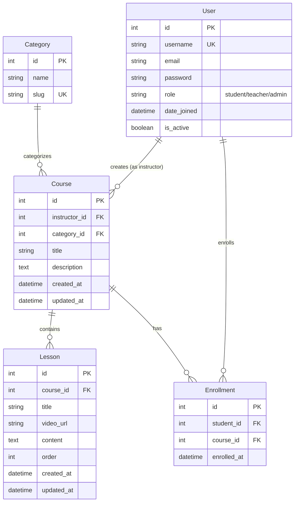

# LMS Database Schema

## Entity Relationship Diagram

## Relationships

### **User → Course (One-to-Many)**
- A User (with role `teacher`) can create multiple Courses
- Each Course has one instructor (User)
- Foreign Key: `Course.instructor_id` → `User.id`
- Related name: `courses_created`

### **Category → Course (One-to-Many)**
- A Category can have multiple Courses
- Each Course belongs to one Category
- Foreign Key: `Course.category_id` → `Category.id`
- Related name: `courses`

### **Course → Lesson (One-to-Many)**
- A Course can have multiple Lessons
- Each Lesson belongs to one Course
- Foreign Key: `Lesson.course_id` → `Course.id`
- Related name: `lessons`

### **User → Enrollment (One-to-Many)**
- A User (with role `student`) can have multiple Enrollments
- Each Enrollment belongs to one student (User)
- Foreign Key: `Enrollment.student_id` → `User.id`
- Related name: `enrollments`

### **Course → Enrollment (One-to-Many)**
- A Course can have multiple Enrollments
- Each Enrollment is for one Course
- Foreign Key: `Enrollment.course_id` → `Course.id`
- Related name: `enrollments`
- **Constraint**: Unique together (`student_id`, `course_id`) - prevents duplicate enrollments

## Field Details

### **User (Custom Model)**
- Extends Django's `AbstractUser`
- Additional field: `role` (choices: student/teacher/admin)
- Default role: `student`

### **Category**
- Simple classification for courses
- Slug field for URL-friendly names (unique)

### **Course**
- Main content container
- Instructor auto-assigned when teacher creates course
- Timestamps track creation and updates

### **Lesson**
- Ordered content within a course
- Supports video URLs and text content
- Ordered by `order` field (ascending)

### **Enrollment**
- Junction table for Student-Course relationship
- Tracks when student enrolled in course
- Prevents duplicate enrollments via unique constraint

## Database Constraints

1. **Unique Constraints**
   - `User.username` - unique
   - `Category.slug` - unique
   - `(Enrollment.student_id, Enrollment.course_id)` - unique together

2. **Foreign Key Constraints**
   - All foreign keys use `CASCADE` on delete
   - Deleting a User deletes their created Courses and Enrollments
   - Deleting a Course deletes its Lessons and Enrollments
   - Deleting a Category deletes its Courses

3. **Default Values**
   - `User.role` = 'student'
   - `Lesson.order` = 0
   - Auto-generated timestamps on create/update
